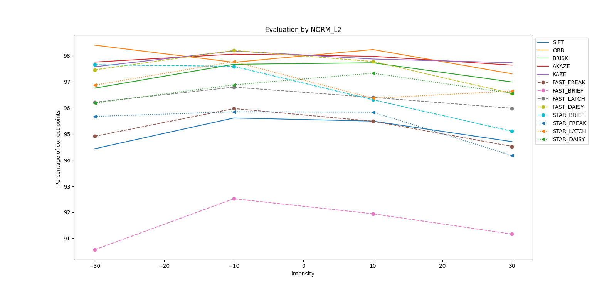
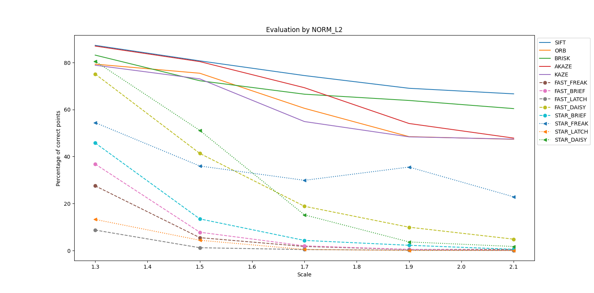
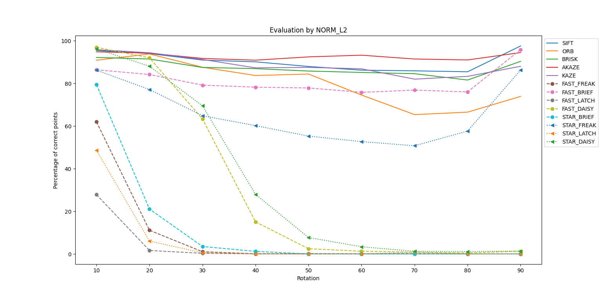

# Feature Detection and Matching Evaluation

## Project Overview

This project evaluates various feature detection and matching methods using different scenarios with both synthetic and real-world image transformations. The evaluation is conducted using several standard image processing techniques, and the results are presented in a comparative format.

## Prerequisites

- **Python:** The script has been developed and tested with Python 3.8.2

- **Libraries:** The following libraries are required:
  - numpy 1.21.6
  - opencv 4.9.0
  - matplotlib
  - pykitti
  - time
  - prettytable
  - tqdm

## Dataset

The script expects the KITTI dataset to be available in  : http://www.cvlibs.net/datasets/kitti/.

## Feature Detection and Matching Methods

The following methods are evaluated in this project:

- SIFT (detector and descriptor)
- ORB  (detector and descriptor)
- BRISK (detector and descriptor)
- AKAZE (detector and descriptor)
- KAZE  (detector and descriptor)
- FAST (Detector) with BRIEF (Descreptor)
- FAST (detector) with FREAK (descriptor)
- FAST (detector) with LATCH (descriptor)
- FAST (detector) with DAISY (descriptor)
- STAR (detector) with BRIEF (descriptor)
- STAR (detector) with FREAK (descriptor)
- STAR (detector) with LATCH (descriptor)
- STAR (detector) with DAISY (descriptor)

## Matching Methods:
Euclidian Distance L2

## Evaluation Metrics

The performance of each method is evaluated based on the number of correctly matched points for Scenarios 1, 2, and 3. 

For the other scenarios, the following metrics are used:

1. **Execution Time (s)**
2. **Number of Points per Image**
3. **Matching Rate (%)**

## Scenarios

The project includes the following scenarios for evaluation:

### Scenario 1: Intensity Changes

For a given image `I`, 8 transformed images are created by varying the intensity. The transformation is defined as:

\[ I + b \]

Where \( b \in \{-30, -10, 10, 30\} \).

### Scenario 2: Scale Changes

For a given image `I`, 7 transformed images are created by changing the scale. The transformation is defined as:

\[ I_s \]

Where \( s \in \{1.3, 1.5, 1.7, 1.9, 2.1\} \).

### Scenario 3: Rotation Changes

For a given image `I`, 9 transformed images are created by applying rotations. The transformations are defined as:

\[ I_{10}, I_{20}, ..., I_{90} \]

Where the rotation angles are from 10° to 90° with a step of 10°.

### Scenario 4: Stereo Rectified Pair

This scenario uses rectified stereo image pairs for evaluation.

|   Method   | Execution time (s) | Number of points per image | Matching rate (%) |
|------------|--------------------|----------------------------|-------------------|
|    SIFT    |        0.71        |            1104            |       73.27       |
|    ORB     |        0.04        |            130             |       61.76       |
|   BRISK    |        1.44        |            1276            |       73.29       |
|   AKAZE    |        1.74        |            1228            |       83.50       |
|    KAZE    |        0.46        |            784             |       79.63       |
| FAST_FREAK |        1.88        |            2299            |       73.49       |
| FAST_BRIEF |        3.77        |            1540            |       57.05       |
| FAST_LATCH |        2.94        |            2053            |       70.37       |
| FAST_DAISY |        5.37        |            4192            |       89.26       |
| STAR_BRIEF |        0.10        |            269             |       79.15       |
| STAR_FREAK |        0.20        |            185             |       67.54       |
| STAR_LATCH |        0.18        |            244             |       76.26       |
| STAR_DAISY |        0.45        |            348             |       86.38       |

### Scenario 5: Consecutive Frames with Forward Motion

This scenario evaluates two consecutive images captured by the same camera with forward motion.

|   Method   | Execution time (s) | Number of points per image | Matching rate (%) |
|------------|--------------------|----------------------------|-------------------|
|    SIFT    |        0.82        |            1225            |       76.57       |
|    ORB     |        0.06        |            151             |       68.90       |
|   BRISK    |        1.63        |            1512            |       77.03       |
|   AKAZE    |        1.48        |            1217            |       83.28       |
|    KAZE    |        0.45        |            814             |       80.96       |
| FAST_FREAK |        2.29        |            2468            |       71.53       |
| FAST_BRIEF |        4.45        |            1704            |       56.94       |
| FAST_LATCH |        3.75        |            2156            |       68.50       |
| FAST_DAISY |        6.27        |            4618            |       88.25       |
| STAR_BRIEF |        0.07        |            280             |       78.57       |
| STAR_FREAK |        0.09        |            191             |       67.74       |
| STAR_LATCH |        0.13        |            248             |       76.08       |
| STAR_DAISY |        0.31        |            363             |       86.60       |

### Scenario 6: Temporal Stereo Pair

This scenario evaluates the pair \((I(t), I'(t+1))\), where \(I(t)\) and \(I'(t+1)\) are captured by stereo cameras at times \(t\) and \(t+1\), respectively.

|   Method   | Execution time (s) | Number of points per image | Matching rate (%) |
|------------|--------------------|----------------------------|-------------------|
|    SIFT    |        0.88        |            938             |       66.36       |
|    ORB     |        0.04        |             98             |       51.34       |
|   BRISK    |        1.32        |            1050            |       65.55       |
|   AKAZE    |        1.55        |            985             |       76.27       |
|    KAZE    |        0.41        |            607             |       69.85       |
| FAST_FREAK |        1.91        |            1690            |       60.65       |
| FAST_BRIEF |        3.57        |            1160            |       46.28       |
| FAST_LATCH |        2.97        |            1371            |       54.49       |
| FAST_DAISY |        4.99        |            3472            |       82.51       |
| STAR_BRIEF |        0.08        |            201             |       67.36       |
| STAR_FREAK |        0.09        |            134             |       54.80       |
| STAR_LATCH |        0.12        |            165             |       61.02       |
| STAR_DAISY |        0.29        |            292             |       79.23       |

### Scenario 7: Advanced Temporal Stereo Pair

This scenario evaluates the pair \((I(t), I'(t+2))\), where \(I(t)\) and \(I'(t+2)\) are captured by stereo cameras at times \(t\) and \(t+2\), respectively.

|   Method   | Execution time (s) | Number of points per image | Matching rate (%) |
|------------|--------------------|----------------------------|-------------------|
|    SIFT    |        0.71        |            731             |       57.13       |
|    ORB     |        0.04        |             75             |       41.22       |
|   BRISK    |        1.23        |            810             |       56.00       |
|   AKAZE    |        1.42        |            738             |       67.45       |
|    KAZE    |        0.39        |            427             |       56.98       |
| FAST_FREAK |        1.73        |            1075            |       44.11       |
| FAST_BRIEF |        4.11        |            674             |       29.72       |
| FAST_LATCH |        2.85        |            786             |       35.71       |
| FAST_DAISY |        4.78        |            2569            |       74.66       |
| STAR_BRIEF |        0.06        |            140             |       53.07       |
| STAR_FREAK |        0.10        |             91             |       41.09       |
| STAR_LATCH |        0.11        |            103             |       44.45       |
| STAR_DAISY |        0.29        |            234             |       72.59       |

## Feel free to reach out if you have any questions or need further assistance!

